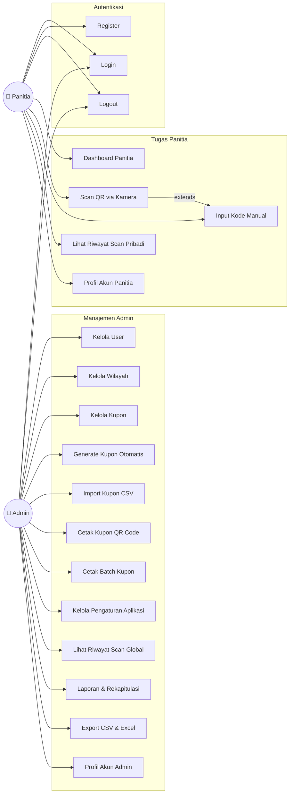
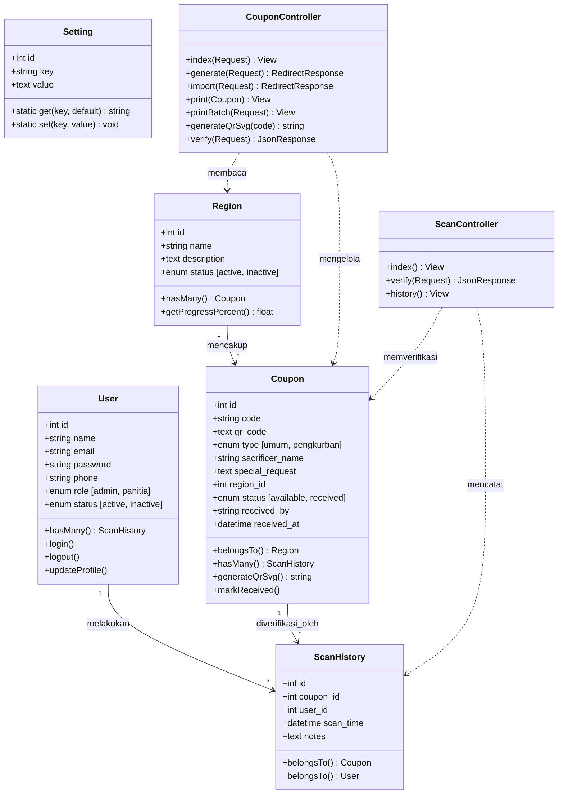
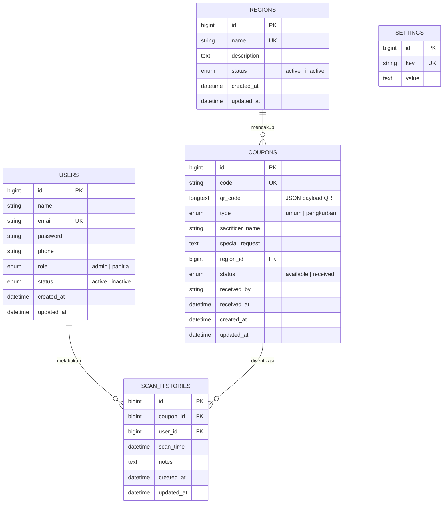
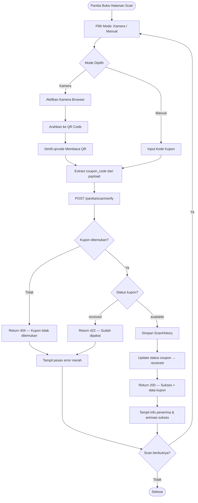
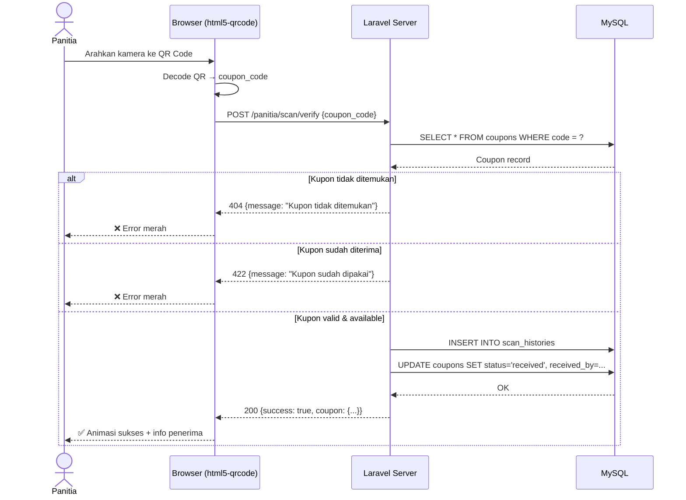
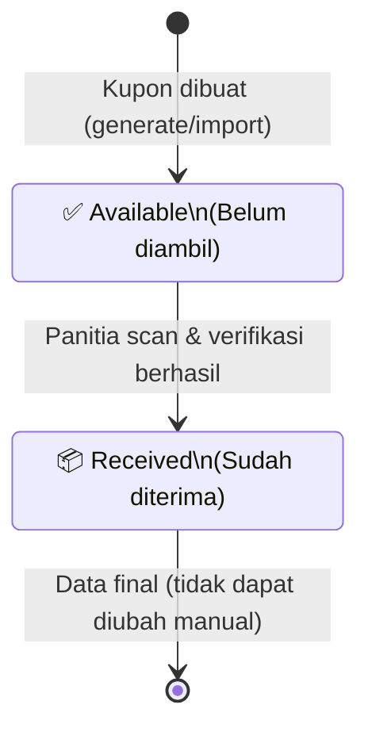
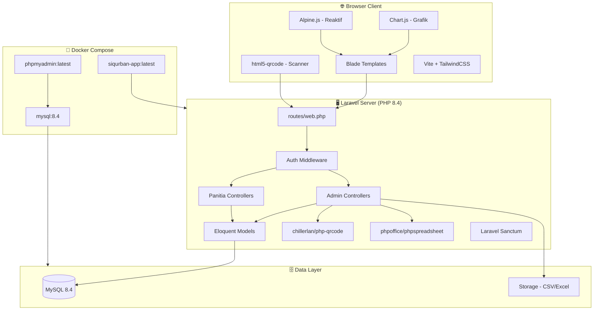
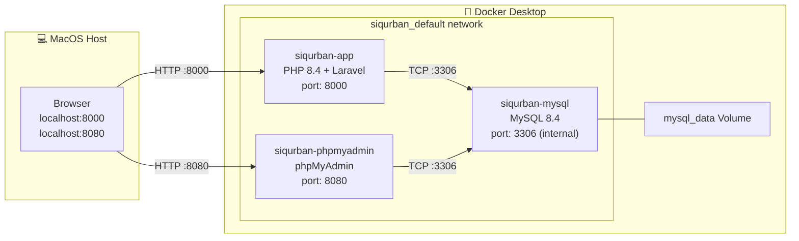

# Laporan Proyek Rekayasa Perangkat Lunak

## Judul

**Perancangan dan Implementasi Aplikasi Web SI Qurban**  
Menggunakan Laravel 11, TailwindCSS, MySQL, Docker, dan QR Code

---

## Latar Belakang

Distribusi daging kurban pada banyak lembaga masih dilakukan secara manual menggunakan daftar cetak dan pencatatan sederhana. Pendekatan tersebut sering menimbulkan masalah berupa duplikasi data, kesalahan verifikasi penerima, antrian tidak tertib, serta kesulitan saat membuat laporan akhir.

SI Qurban dikembangkan sebagai solusi digital untuk membantu admin dan panitia dalam mengelola data user, wilayah distribusi, kupon QR Code, dan riwayat verifikasi. Proyek ini dirancang relevan dengan kebutuhan pembelajaran pada mata kuliah Rekayasa Perangkat Lunak, khususnya dalam aspek analisis kebutuhan, implementasi sistem, pengujian, dan dokumentasi teknis.

---

## Rumusan Masalah

1. Bagaimana merancang aplikasi web yang mampu mengelola distribusi kupon kurban secara terstruktur?
2. Bagaimana mengimplementasikan QR Code nyata (SVG) pada setiap kupon untuk verifikasi saat pembagian?
3. Bagaimana menyediakan fitur scan QR Code via kamera browser tanpa aplikasi tambahan?
4. Bagaimana mendokumentasikan proses pengembangan menggunakan UML dan Agile Scrum?

---

## Tujuan

1. Menghasilkan aplikasi SI Qurban berbasis web menggunakan Laravel 11, TailwindCSS, dan MySQL.
2. Menyediakan QR Code SVG nyata untuk setiap kupon dan scanner via kamera browser.
3. Menyusun dokumentasi teknis UML lengkap (Use Case, Class, Sequence, ERD, Activity, Component, Deployment, State Machine).
4. Mendeploy aplikasi menggunakan Docker Desktop dengan phpMyAdmin terintegrasi.

---

## Pembahasan

### Deskripsi Sistem

SI Qurban mendukung dua jenis kupon:
- **Kupon Pengkurban**: berisi nama dan permintaan khusus pengkurban.
- **Kupon Umum**: hanya berisi nomor/kode kupon untuk masyarakat umum.

Pengguna dibagi dua peran: **Admin** (kontrol penuh) dan **Panitia** (verifikasi kupon).

---

### Metode Pengembangan Agile Scrum

#### Product Backlog

| No | Product Backlog | Prioritas |
| --- | --- | --- |
| 1 | Registrasi dan login user | Tinggi |
| 2 | Dashboard admin dan panitia | Tinggi |
| 3 | CRUD user, wilayah, kupon | Tinggi |
| 4 | Generate kupon otomatis dengan QR Code SVG | Tinggi |
| 5 | Import kupon dari CSV | Tinggi |
| 6 | Scan QR Code via kamera browser | Tinggi |
| 7 | Verifikasi kupon oleh panitia | Tinggi |
| 8 | Laporan distribusi + ekspor CSV & Excel | Sedang |
| 9 | Pengaturan aplikasi (nama masjid, tahun) | Sedang |
| 10 | Profil akun admin & panitia | Sedang |
| 11 | Filter & search kupon | Sedang |
| 12 | Cetak batch kupon | Sedang |
| 13 | Docker multi-stage build + phpMyAdmin | Rendah |

#### Sprint Planning

| Sprint | Aktivitas Utama |
| --- | --- |
| Sprint 1 | Setup Laravel, ERD, auth, layout premium, dashboard awal |
| Sprint 2 | CRUD user/wilayah/kupon, generate QR Code SVG, import CSV |
| Sprint 3 | Scanner QR kamera, verifikasi, laporan Excel, Docker, dokumentasi |

---

### Perancangan Sistem (UML)

#### 1. Use Case Diagram



---

#### 2. Class Diagram (UML)



---

#### 3. ERD (Entity Relationship Diagram)



---

#### 4. Activity Diagram — Proses Verifikasi Kupon



---

#### 5. Sequence Diagram — Scan & Verifikasi



---

#### 6. State Machine Diagram — Status Kupon



---

#### 7. Component Diagram — Arsitektur Sistem



---

#### 8. Deployment Diagram — Docker Desktop



---

### Struktur Database

| Tabel | Fungsi |
|---|---|
| `users` | Akun admin dan panitia |
| `regions` | Wilayah distribusi |
| `coupons` | Data kupon dengan QR code payload |
| `scan_histories` | Log setiap verifikasi kupon |
| `settings` | Konfigurasi aplikasi (nama masjid, tahun) |
| `personal_access_tokens` | Token Sanctum API |
| `password_reset_tokens` | Reset password |

---

### Struktur Folder Laravel

```text
app/
  Http/
    Controllers/
      Admin/
        CouponController.php    ← CRUD + Generate + Import + QR Code
        DashboardController.php ← Dashboard + Pengaturan + Profil Admin
        RegionController.php    ← CRUD Wilayah
        ReportController.php    ← Laporan + Export CSV/Excel
        UserController.php      ← CRUD User
      Panitia/
        DashboardController.php ← Dashboard + Profil Panitia
        ScanController.php      ← Verifikasi Kupon
      Auth/
        AuthController.php      ← Login + Register + Logout
    Requests/
      GenerateCouponRequest.php
      ImportCouponRequest.php
      StoreCouponRequest.php
      UpdateCouponRequest.php
      UpdateSettingsRequest.php
  Models/
    Coupon.php, Region.php, ScanHistory.php, Setting.php, User.php
database/
  migrations/       ← 7 file migrasi
  seeders/
    DatabaseSeeder.php ← Demo data + QR Code
docs/
  laporan.md        ← Dokumen ini
docker/
  start-container.sh
resources/
  css/app.css       ← TailwindCSS + Inter + Animasi
  js/app.js         ← Alpine.js
  views/
    welcome.blade.php    ← Landing page premium dark
    layouts/app.blade.php ← Sidebar + navbar premium
    auth/                ← Login + Register
    admin/               ← Dashboard, User, Wilayah, Kupon, Laporan
    panitia/             ← Dashboard, Scan (QR + Manual), Profil
```

---

### Stack Teknologi

| Layer | Teknologi |
|---|---|
| Backend | Laravel 11, PHP 8.4 |
| Frontend | Blade, TailwindCSS v3, Alpine.js, Vite |
| QR Code | chillerlan/php-qrcode v6 (SVG) |
| QR Scanner | html5-qrcode v2.3 (CDN) |
| Grafik | Chart.js v4 (CDN) |
| Excel | phpoffice/phpspreadsheet v2 |
| Database | MySQL 8.4 |
| Container | Docker Desktop (multi-stage build) |
| Manajemen DB | phpMyAdmin |

---

### Pengujian Black Box Testing

| No | Fitur | Skenario Uji | Input | Output Diharapkan | Status |
| --- | --- | --- | --- | --- | --- |
| 1 | Register | Data valid | Nama, email unik, password | Akun tersimpan, redirect dashboard | ✅ Lulus |
| 2 | Register | Email duplikat | Email sudah ada | Error validasi duplikat | ✅ Lulus |
| 3 | Login | Admin valid | Email+pass admin | Redirect dashboard admin | ✅ Lulus |
| 4 | Login | Password salah | Password keliru | Pesan error login | ✅ Lulus |
| 5 | Generate Kupon | Qty 10 | Wilayah + qty + tipe | 10 kupon tersimpan + QR Code | ✅ Lulus |
| 6 | QR Code | Generate SVG | Kode kupon | SVG QR Code muncul di halaman print | ✅ Lulus |
| 7 | Cetak Kupon | Halaman print | Buka URL print | Kartu kupon premium + QR Code tampil | ✅ Lulus |
| 8 | Cetak Batch | Pilih 5 kupon | Centang + klik cetak batch | 5 kartu kupon muncul di halaman batch | ✅ Lulus |
| 9 | Import CSV | File valid | CSV berformat benar | Kupon tersimpan sesuai jumlah baris | ✅ Lulus |
| 10 | Scan QR Kamera | QR valid | Arahkan kamera | Kupon terverifikasi, status → received | ✅ Lulus |
| 11 | Scan Manual | Kode valid | Input kode di form | Kupon terverifikasi | ✅ Lulus |
| 12 | Scan Duplikat | Kupon sudah dipakai | Scan kupon received | Error "Kupon sudah digunakan" | ✅ Lulus |
| 13 | Filter Kupon | Filter status=received | Pilih filter | Hanya kupon received tampil | ✅ Lulus |
| 14 | Export CSV | Admin klik unduh | Klik tombol CSV | File CSV terunduh dengan BOM UTF-8 | ✅ Lulus |
| 15 | Export Excel | Admin klik unduh | Klik tombol Excel | File .xlsx terunduh dengan styling | ✅ Lulus |
| 16 | Dashboard Chart | Buka dashboard | Login admin | Chart bar distribusi wilayah tampil | ✅ Lulus |
| 17 | Profil Admin | Update profil | Nama + email baru | Data tersimpan, flash sukses | ✅ Lulus |
| 18 | Pengaturan | Ubah nama masjid | Input nama baru | Setting tersimpan, tampil di print | ✅ Lulus |
| 19 | phpMyAdmin | Akses port 8080 | Buka browser | Login phpMyAdmin berhasil | ✅ Lulus |
| 20 | Docker Build | docker compose up | Terminal | App running di port 8000 otomatis | ✅ Lulus |

---

### Cara Menjalankan dengan Docker Desktop

```bash
# 1. Clone & masuk folder
cd KUPON-QURBAN

# 2. Siapkan .env Docker
cp .env.docker.example .env.docker

# 3. Jalankan seluruh stack (build otomatis termasuk frontend)
docker compose up --build

# 4. Akses:
# Aplikasi   → http://localhost:8000
# phpMyAdmin → http://localhost:8080
# Login      → admin@siqurban.local / password
```

---

## Kesimpulan

SI Qurban berhasil dirancang dan diimplementasikan sebagai aplikasi web berbasis Laravel 11 yang memenuhi kebutuhan operasional distribusi daging kurban secara digital. Sistem telah menyediakan:

- **QR Code SVG nyata** pada setiap kupon (bukan sekedar JSON string)
- **Scanner QR Code via kamera browser** tanpa instalasi aplikasi tambahan
- **Dashboard premium** dengan Chart.js, progress bar per wilayah, dan statistik lengkap
- **Ekspor laporan** dalam format CSV dan Excel (.xlsx) dengan styling
- **Docker multi-stage build** yang membangun frontend secara otomatis di dalam container
- **phpMyAdmin terintegrasi** untuk kemudahan manajemen database via browser
- **Dokumentasi UML lengkap**: Use Case, Class, ERD, Activity, Sequence, State Machine, Component, dan Deployment Diagram

Penerapan Agile Scrum dalam tiga sprint membantu pembagian pekerjaan yang terukur. Dari sisi teknis, Laravel mempermudah pengembangan backend, TailwindCSS menghasilkan antarmuka premium yang responsif, dan Docker memastikan reprodusibilitas lingkungan pengembangan dan produksi.
